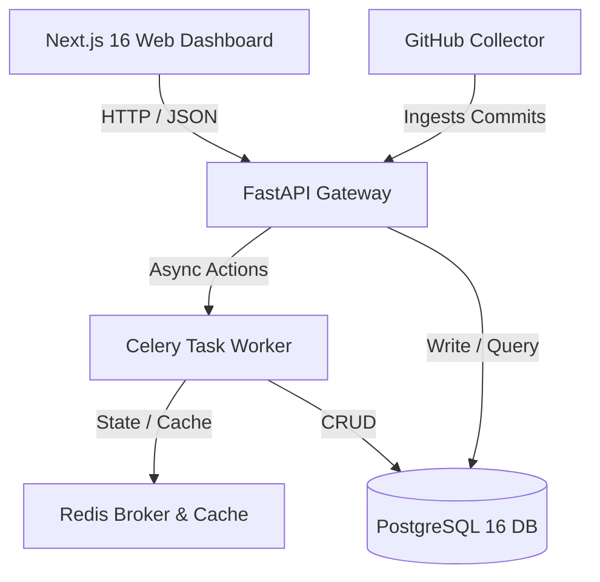

# 🛡 SENTINEL — Git Governance & Release Readiness Dashboard

SENTINEL is an enterprise-grade Git Governance and Release Readiness Platform. It continuously analyzes Git repositories against configured customer folders and deployment targets, verifying ticket coverage, commit propagation delays, line-ending consistency, and compliance violations to compute a real-time composite **Governance Score**.

---

## 🏗 System Architecture

SENTINEL is structured as a modern full-stack web application:



### 1. Backend Service Layer (`/backend`)
- **FastAPI**: Serves the REST API gateway, authentication, and endpoint routing.
- **SQLAlchemy (Async)**: Integrates with Postgres 16 for all database operations.
- **Celery & Redis**: Offloads git ingestion, daily snapshot analytics, and report generation.
- **Matplotlib & openpyxl & WeasyPrint**: The Reporting Engine modules.

### 2. Frontend Interface (`/frontend`)
- **Next.js 16 (App Router)**: Single Page App client with premium dark mode aesthetics.
- **Zustand**: Clean, reactive global state stores.
- **Recharts**: Responsive SVGs rendering historical health and coverage trends.

---

## 🚦 Getting Started

### Option A: Local Development Setup

#### 1. Database & Broker (via Docker)
Start the PostgreSQL and Redis containers:
```bash
docker compose -f docker-compose.dev.yml up -d
```

#### 2. Run Backend API & Worker
Ensure you have Python 3.12 installed.
```bash
cd backend
python -m venv .venv
.venv\Scripts\activate      # Windows
source .venv/bin/activate    # macOS/Linux

pip install -r requirements.txt -r requirements-dev.txt

# Run migrations
alembic upgrade head

# Seed initial mock data
$env:PYTHONPATH="."
python app/core/seed.py

# Start API Server
uvicorn app.main:app --reload --port 8000

# Start Celery Worker (in a separate terminal)
celery -A app.celery_app worker --loglevel=info
```

#### 3. Run Frontend App
Ensure you have Node.js 18+ installed.
```bash
cd frontend
npm install
npm run dev
```
Open [http://localhost:3000](http://localhost:3000) to view the dashboard. Use default admin credentials: `admin` / `admin`.

---

### Option B: Production Docker Deployment (Multi-service Compose)

Build and boot the entire stack (Postgres, Redis, Backend, Celery, Frontend, and Nginx proxy) with a single command:
```bash
docker compose up -d --build
```
Nginx will listen on port `80`. Access the application via `http://localhost`.

---

## 🧪 Running Tests

### Backend Unit Tests
Run the pytest test suite:
```bash
cd backend
$env:PYTHONPATH="."
.venv\Scripts\pytest
```

### Frontend Typechecking & Linter
```bash
cd frontend
npm run lint
npm run build
```

---

## 📈 Dashboard Key Features

1. **Composite Governance Gauge**: Computes repository grade (A-F) combining health parameters minus severity-weighted active violations.
2. **Jira Coverage Matrix**: Maps Jiras to expected folder deployments showing real-time sync checkpoints.
3. **Merge Delay Analytics**: Measures average and P95 propagation time for Jira tickets to travel from staging to customer configurations.
4. **SHA256 Content Drift**: Scrapes and compares file checksums across deployment directories to detect uncommitted changes or environment skew.
5. **Executive Report Builder**: One-click compliance exports to a 9-sheet Excel sheet or high-quality PDF.
